# Домашнее задание к занятию 1 «Введение в Ansible»

## Подготовка к выполнению

1. Установите Ansible версии 2.10 или выше.

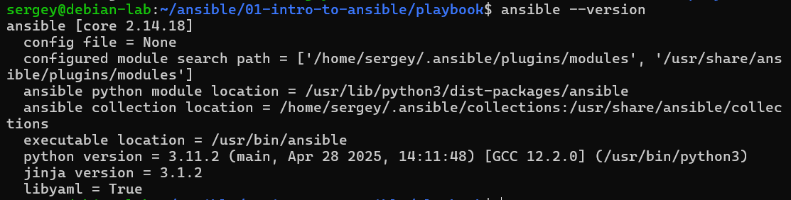

2. Создайте свой публичный репозиторий на GitHub с произвольным именем.
3. Скачайте [Playbook](./playbook/) из репозитория с домашним заданием и перенесите его в свой репозиторий.

## Основная часть

1. Попробуйте запустить playbook на окружении из `test.yml`, зафиксируйте значение, которое имеет факт `some_fact` для указанного хоста при выполнении playbook.

```bash
ansible-playbook -i inventory/test.yml site.yml
```

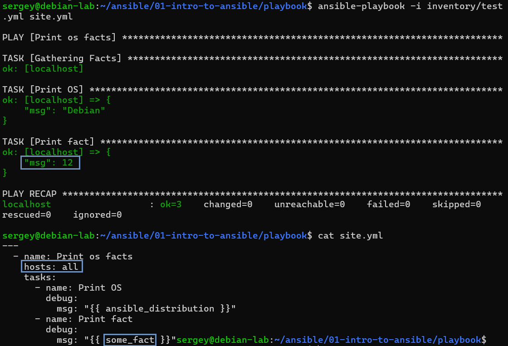

Переменная `some_fact` выводится в блоке `Print fact` и её значение - `12`.

2. Найдите файл с переменными (group_vars), в котором задаётся найденное в первом пункте значение, и поменяйте его на `all default fact`.

Поскольку плейбук должен выполнится для группы `all` (`hosts: all`), то переменные должны находиться в папке `group_vars/all`

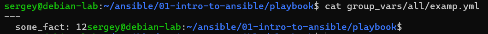

Меняем и проверяем

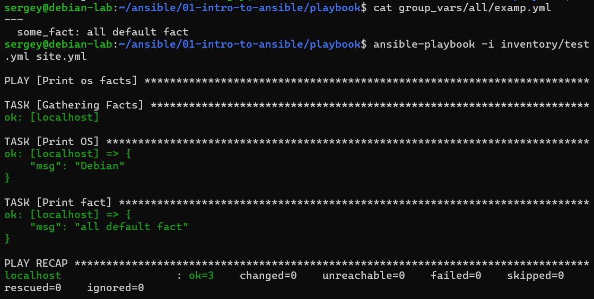

3. Воспользуйтесь подготовленным (используется `docker`) или создайте собственное окружение для проведения дальнейших испытаний.

Воспользуюсь подготовленным `docker`. Запущу два docker-контейнера.

```bash
docker run -d --name centos7 centos:7 sleep infinity
docker run -d --name ubuntu ubuntu:20.04 sleep infinity
```

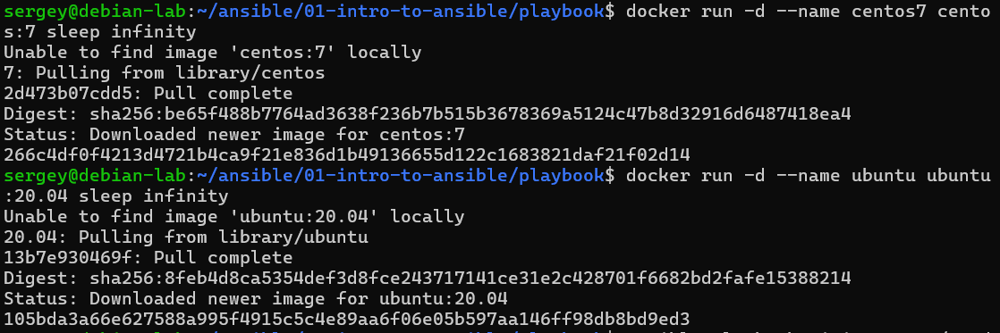

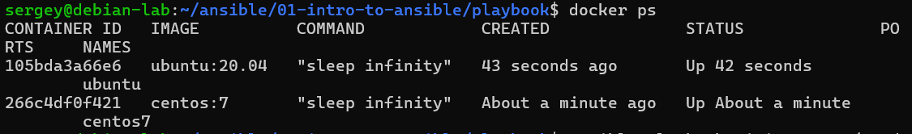

4. Проведите запуск playbook на окружении из `prod.yml`. Зафиксируйте полученные значения `some_fact` для каждого из `managed host`.

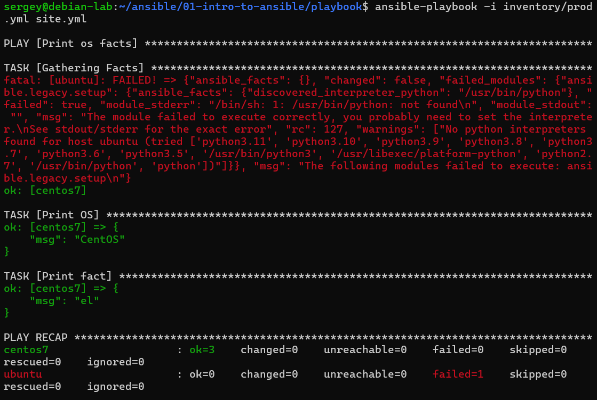

В контейнере `ubuntu` нет `python`, устанавливаю.

```bash
docker exec ubuntu apt-get update
docker exec ubuntu apt-get install -y python3
```

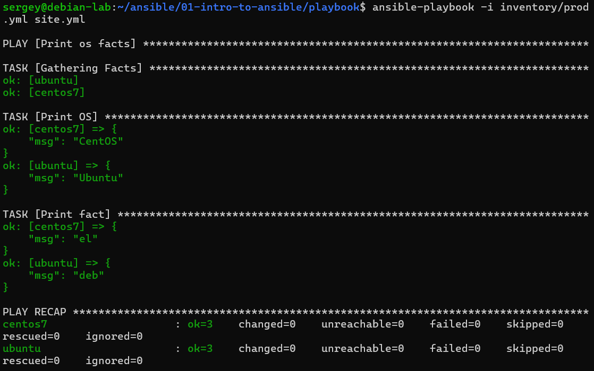

5. Добавьте факты в `group_vars` каждой из групп хостов так, чтобы для `some_fact` получились значения: для `deb` — `deb default fact`, для `el` — `el default fact`.

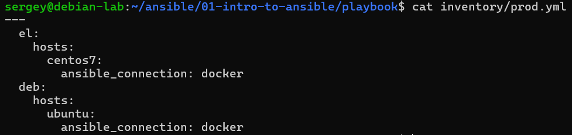

Убедился, да, две группы `deb` и `el`

Заменил значения переменной для группы `deb` в `group_vars/deb/examp.yml`, для `el` - `group_vars/el/examp.yml`.

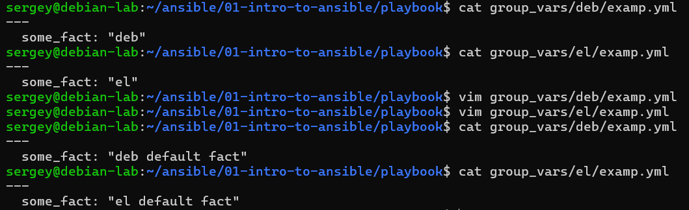

6.  Повторите запуск playbook на окружении `prod.yml`. Убедитесь, что выдаются корректные значения для всех хостов.

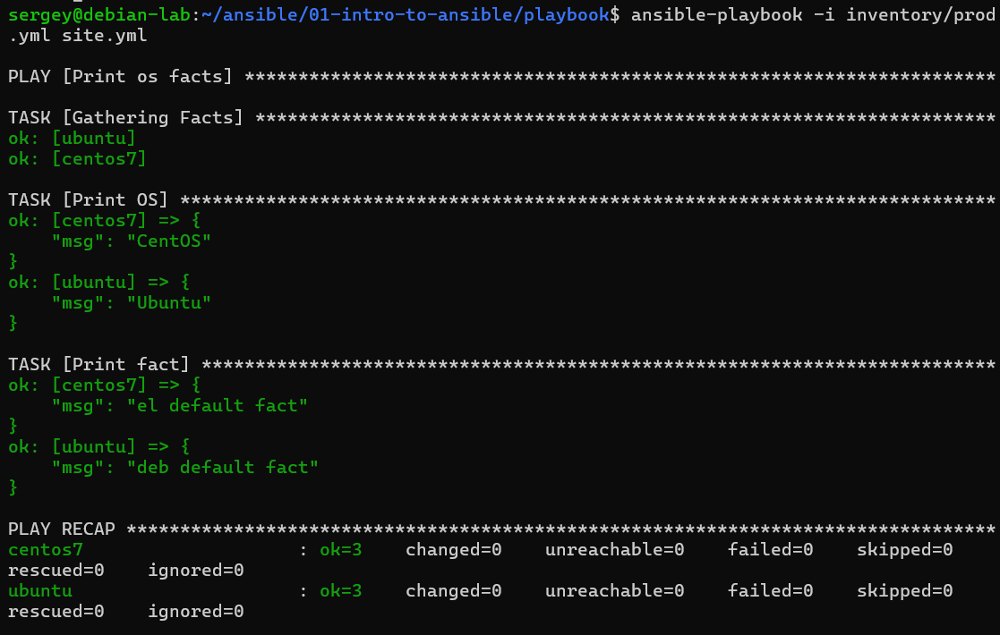

7. При помощи `ansible-vault` зашифруйте факты в `group_vars/deb` и `group_vars/el` с паролем `netology`.

```bash
ansible-vault encrypt group_vars/deb/examp.yml group_vars/el/examp.yml
```

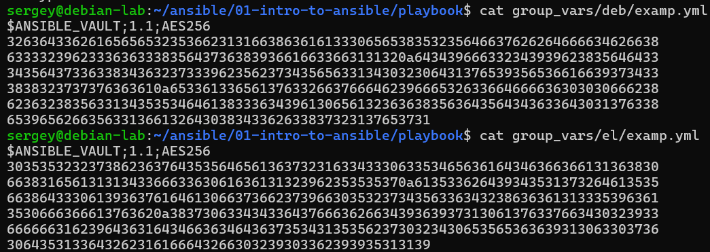

8. Запустите playbook на окружении `prod.yml`. При запуске `ansible` должен запросить у вас пароль. Убедитесь в работоспособности.

```bash
ansible-playbook -i inventory/prod.yml site.yml --ask-vault-pass
```

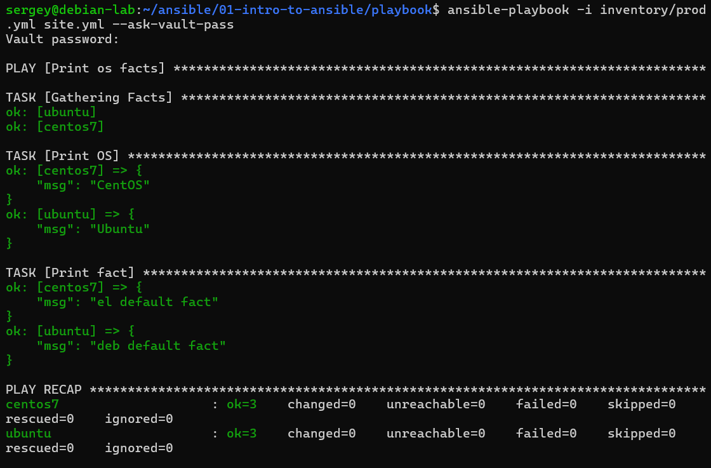

9. Посмотрите при помощи `ansible-doc` список плагинов для подключения. Выберите подходящий для работы на `control node`.

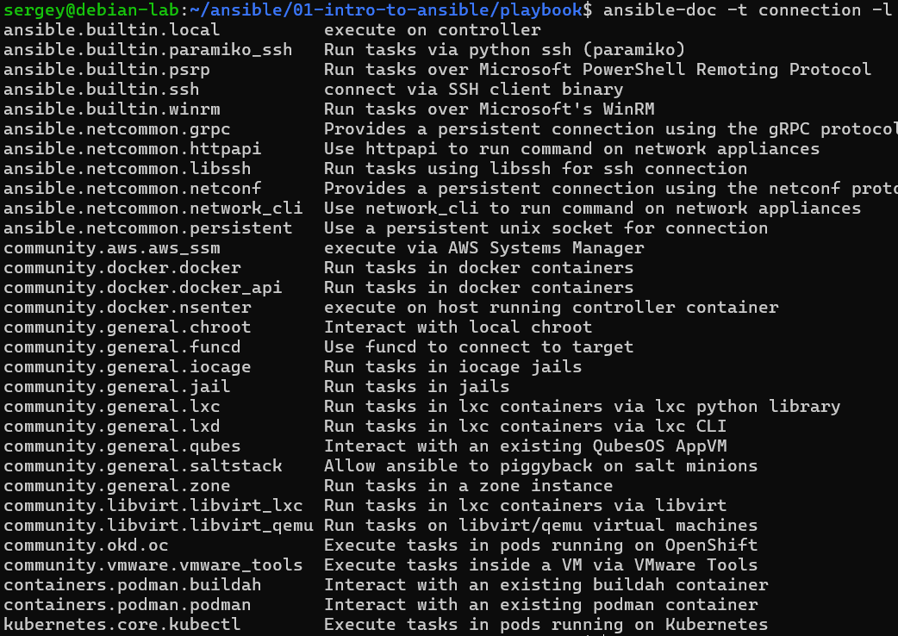

Подходящий для работы на `control node` - `ansible.builtin.local          execute on controller`

10. В `prod.yml` добавьте новую группу хостов с именем  `local`, в ней разместите localhost с необходимым типом подключения.

```yaml
# ...

  local:
    hosts:
      localhost:
        ansible_connection: local
```

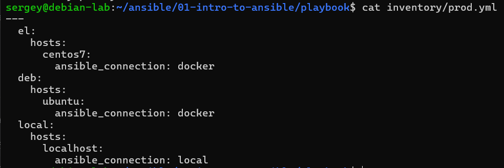

11. Запустите playbook на окружении `prod.yml`. При запуске `ansible` должен запросить у вас пароль. Убедитесь, что факты `some_fact` для каждого из хостов определены из верных `group_vars`.

```bash
ansible-playbook -i inventory/prod.yml site.yml --ask-vault-pass
```

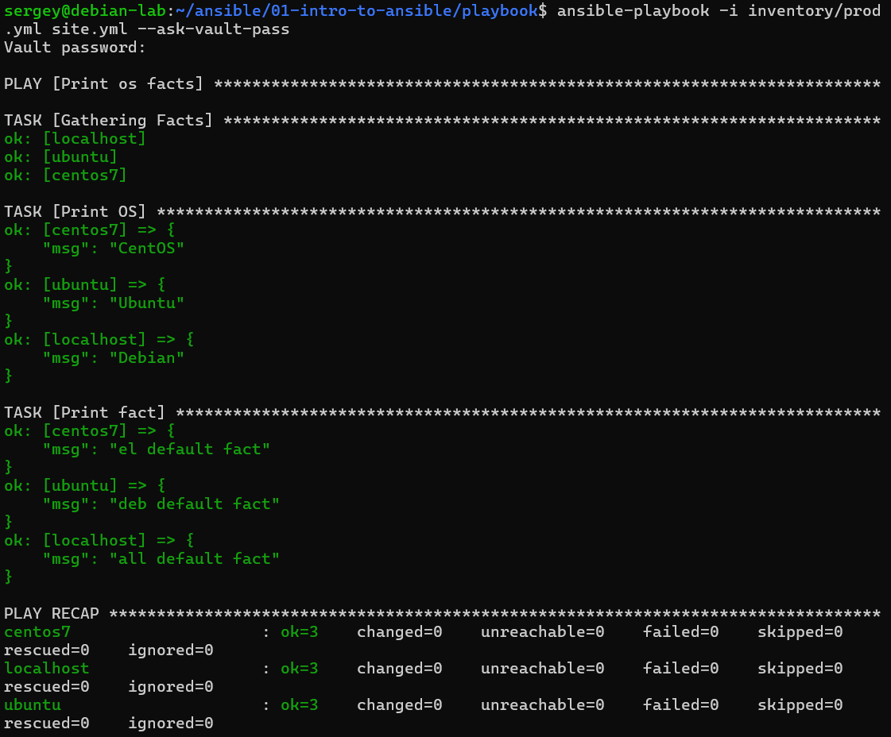

12. Заполните `README.md` ответами на вопросы. Сделайте `git push` в ветку `master`. В ответе отправьте ссылку на ваш открытый репозиторий с изменённым `playbook` и заполненным `README.md`.
13. Предоставьте скриншоты результатов запуска команд.

## Необязательная часть

1. При помощи `ansible-vault` расшифруйте все зашифрованные файлы с переменными.

```bash
ansible-vault decrypt group_vars/deb/examp.yml group_vars/el/examp.yml
```

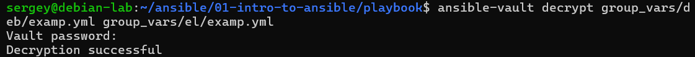

2. Зашифруйте отдельное значение `PaSSw0rd` для переменной `some_fact` паролем `netology`. Добавьте полученное значение в `group_vars/all/exmp.yml`.

```bash
ansible-vault encrypt_string
```

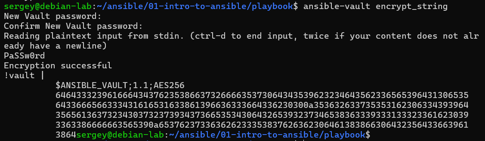

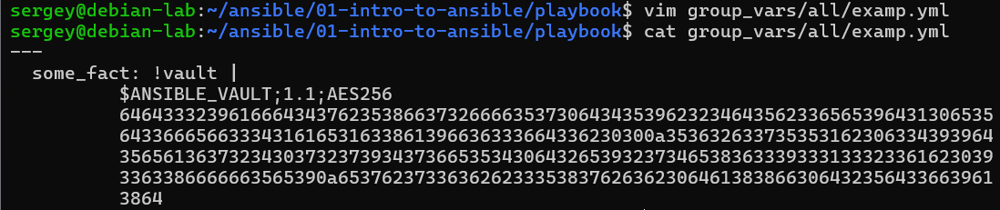

3. Запустите `playbook`, убедитесь, что для нужных хостов применился новый `fact`.

```bash
ansible-playbook -i inventory/prod.yml site.yml --ask-vault-pass
```

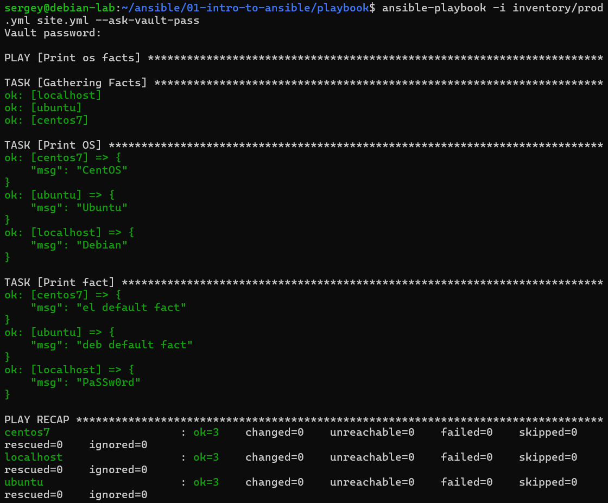

4. Добавьте новую группу хостов `fedora`, самостоятельно придумайте для неё переменную. В качестве образа можно использовать [этот вариант](https://hub.docker.com/r/pycontribs/fedora).

```bash
docker run -d --name fedora pycontribs/fedora sleep infinity
```

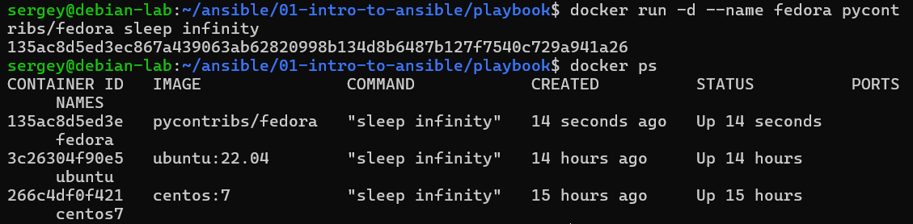

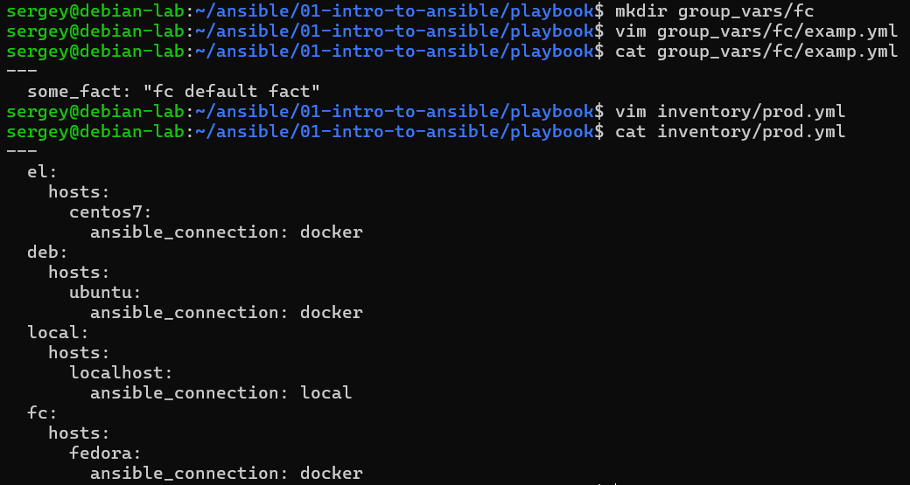

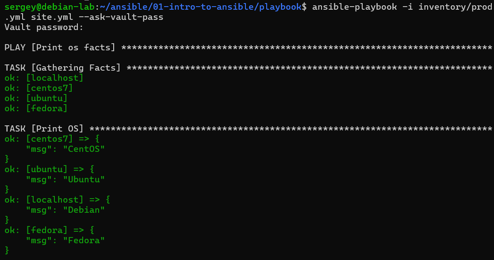

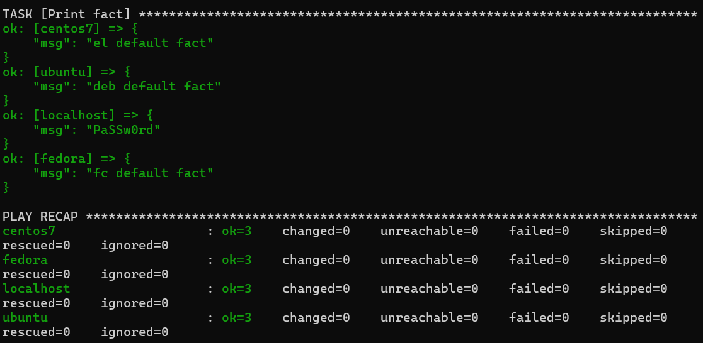

5. Напишите скрипт на bash: автоматизируйте поднятие необходимых контейнеров, запуск ansible-playbook и остановку контейнеров.

```bash
#!/usr/bin/env bash
set -euo pipefail

# Переходим в директорию, где лежит скрипт (чтобы запускать из любого места)
SCRIPT_DIR="$(cd "$(dirname "${BASH_SOURCE[0]}")" && pwd)"
cd "$SCRIPT_DIR"

INVENTORY="inventory/prod.yml"
PLAYBOOK="site.yml"

# Массив: имя_контейнера=образ
declare -A IMAGES=(
    [centos7]="centos:7"
    [ubuntu]="ubuntu:22.04"
    [fedora]="pycontribs/fedora"
)

# Функция гарантированной очистки (сработает даже при ошибке или Ctrl+C)
cleanup() {
    echo -e "\nОстанавливаем и удаляем контейнеры..."
    for name in "${!IMAGES[@]}"; do
        docker rm -f "$name" 2>/dev/null || true
    done
    echo "Контейнеры удалены."
}

# Регистрируем ловушку на любой выход из скрипта
trap cleanup EXIT

echo "Удаляем старые контейнеры (если остались)..."
for name in "${!IMAGES[@]}"; do
    docker rm -f "$name" 2>/dev/null || true
done

echo "Запускаем контейнеры..."
for name in "${!IMAGES[@]}"; do
    docker run -d --name "$name" "${IMAGES[$name]}" sleep infinity
done

# Небольшая пауза для инициализации Docker
sleep 5

# Ubuntu minimal не содержит Python, а он нужен Ansible
echo " Устанавливаем Python в ubuntu..."
docker exec ubuntu apt-get update -qq
docker exec ubuntu apt-get install -y -qq python3 > /dev/null

echo "Запускаем Ansible Playbook..."
ansible-playbook -i "$INVENTORY" "$PLAYBOOK" --ask-vault-pass

echo "Готово!"
# cleanup() вызывается автоматически благодаря trap EXIT
```

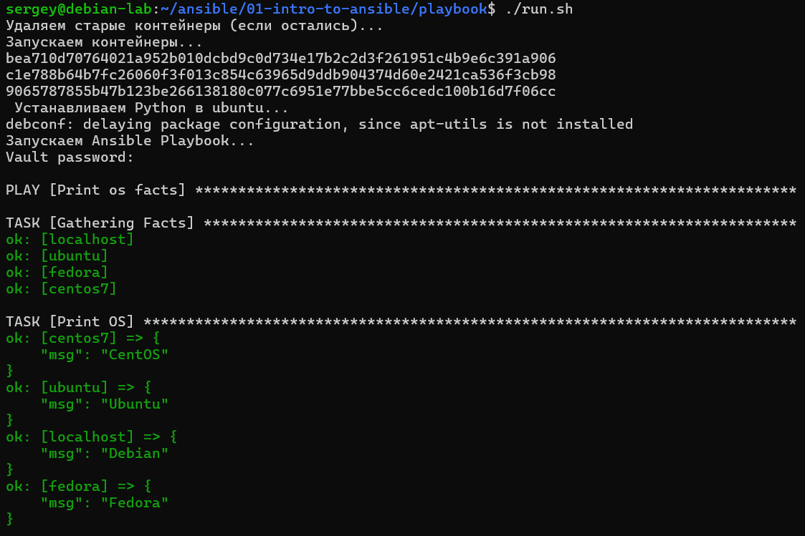

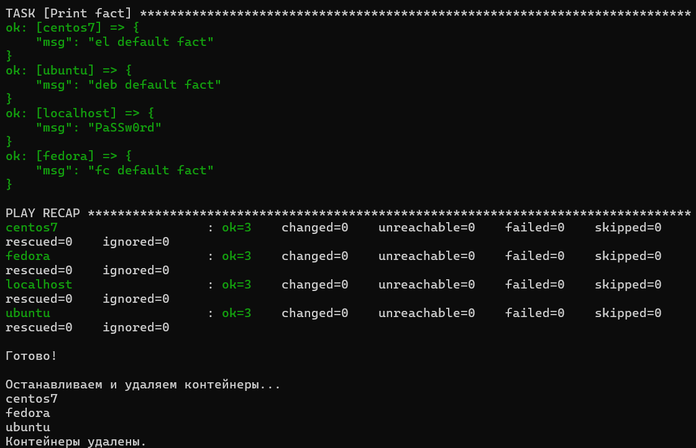

6. Все изменения должны быть зафиксированы и отправлены в ваш личный репозиторий.

---

### Как оформить решение задания

Приложите ссылку на ваше решение в поле «Ссылка на решение» и нажмите «Отправить решение»
---
