# Домашнее задание к занятию 5 «Тестирование roles». Потапчук Сергей.

Все действия производились здесь: **[Vector role](https://github.com/potapchuksa/netology-vector-role)**

[v1.1.0](https://github.com/potapchuksa/netology-vector-role/releases/tag/v1.1.0)

[v1.2.0](https://github.com/potapchuksa/netology-vector-role/releases/tag/v1.2.0)

[tox.ini](https://github.com/potapchuksa/netology-vector-role/blob/main/tox.ini)

## Подготовка к выполнению

1. Установите molecule и его драйвера: `pip3 install "molecule molecule_docker molecule_podman`.

В папке проекта

```bash
python3 -m venv .venv
source .venv/bin/activate
pip3 install ansible ansible-lint yamllint molecule molecule-docker molecule-podman
```

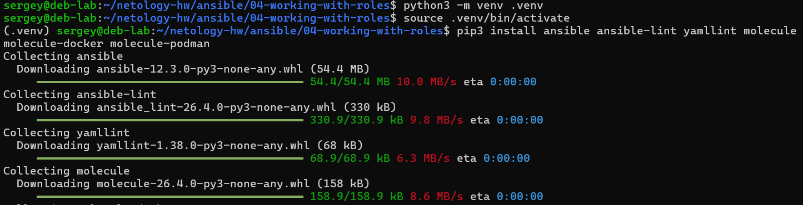

2. Выполните `docker pull aragast/netology:latest` —  это образ с podman, tox и несколькими пайтонами (3.7 и 3.9) внутри.

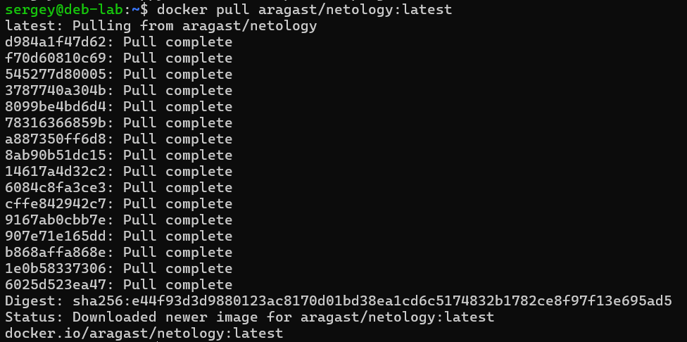

## Основная часть

Ваша цель — настроить тестирование ваших ролей. 

Задача — сделать сценарии тестирования для vector. 

Ожидаемый результат — все сценарии успешно проходят тестирование ролей.

### Molecule

1. Запустите  `molecule test -s ubuntu_xenial` (или с любым другим сценарием, не имеет значения) внутри корневой директории clickhouse-role, посмотрите на вывод команды. Данная команда может отработать с ошибками или не отработать вовсе, это нормально. Наша цель - посмотреть как другие в реальном мире используют молекулу И из чего может состоять сценарий тестирования.

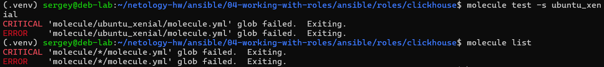

Команда завершилась ошибкой `glob failed` из-за, вероятнее всего, нарушенной структуры папок в molecule/

2. Перейдите в каталог с ролью vector-role и создайте сценарий тестирования по умолчанию при помощи `molecule init scenario --driver-name docker`.

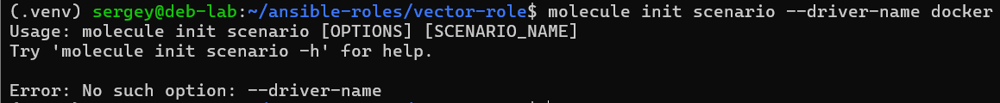

Нет опции `--driver-name`

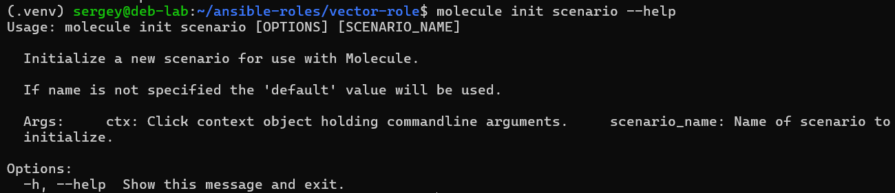

Похоже такой опции вообще не существует.

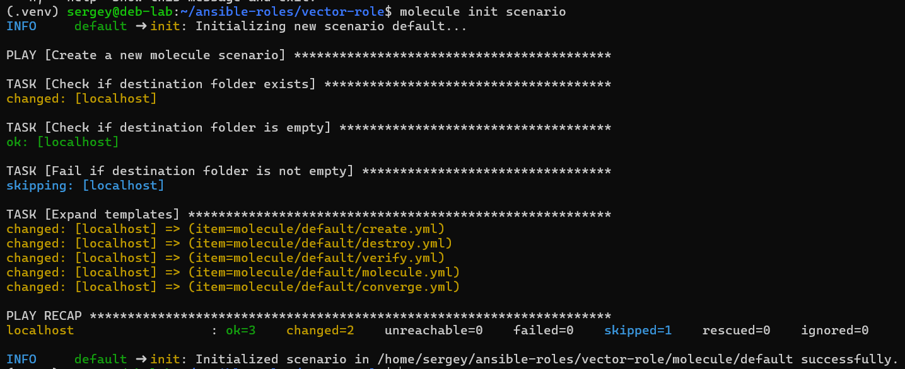

3. Добавьте несколько разных дистрибутивов (oraclelinux:8, ubuntu:latest) для инстансов и протестируйте роль, исправьте найденные ошибки, если они есть.

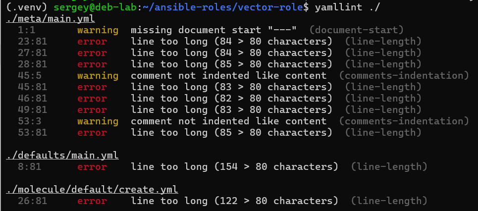

В Ansible-проектах строгий лимит в 80 символов почти всегда смягчают, так как URL репозиториев, описания зависимостей и пути в yml-файлах объективно длиннее (`./meta/main.yml` вообще автосгенерированный).

Чтобы избавиться от "шума" создал в корне роли файл `.yamllint с` таким содержимым:

```yaml
extends: default
rules:
  line-length:
    max: 160
    level: warning
  document-start: disable
  comments-indentation: disable

  comments:
    min-spaces-from-content: 1
  braces:
    max-spaces-inside: 1
  octal-values:
    forbid-implicit-octal: true
    forbid-explicit-octal: true
```

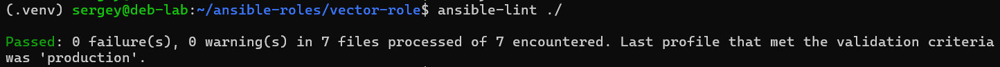

4. Добавьте несколько assert в verify.yml-файл для  проверки работоспособности vector-role (проверка, что конфиг валидный, проверка успешности запуска и др.).

Запуск одной командой: molecule test

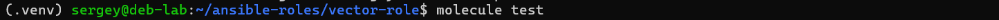

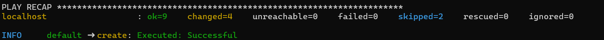

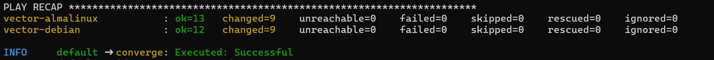

5. Запустите тестирование роли повторно и проверьте, что оно прошло успешно.

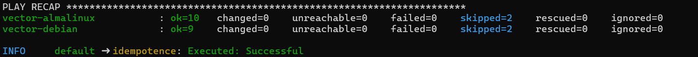

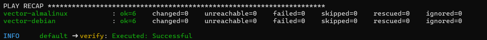

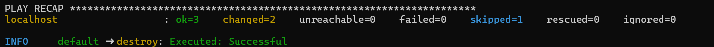

5. Добавьте новый тег на коммит с рабочим сценарием в соответствии с семантическим версионированием.

### Tox

1. Добавьте в директорию с vector-role файлы из [директории](./example).
2. Запустите `docker run --privileged=True -v <path_to_repo>:/opt/vector-role -w /opt/vector-role -it aragast/netology:latest /bin/bash`, где path_to_repo — путь до корня репозитория с vector-role на вашей файловой системе.
3. Внутри контейнера выполните команду `tox`, посмотрите на вывод.
5. Создайте облегчённый сценарий для `molecule` с драйвером `molecule_podman`. Проверьте его на исполнимость.
6. Пропишите правильную команду в `tox.ini`, чтобы запускался облегчённый сценарий.
8. Запустите команду `tox`. Убедитесь, что всё отработало успешно.

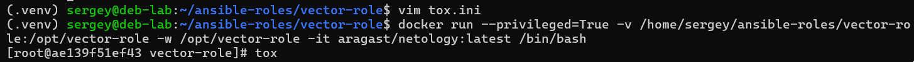

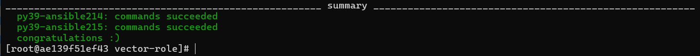

9. Добавьте новый тег на коммит с рабочим сценарием в соответствии с семантическим версионированием.

После выполнения у вас должно получится два сценария molecule и один tox.ini файл в репозитории. Не забудьте указать в ответе теги решений Tox и Molecule заданий. В качестве решения пришлите ссылку на  ваш репозиторий и скриншоты этапов выполнения задания. 

## Необязательная часть

1. Проделайте схожие манипуляции для создания роли LightHouse.
2. Создайте сценарий внутри любой из своих ролей, который умеет поднимать весь стек при помощи всех ролей.
3. Убедитесь в работоспособности своего стека. Создайте отдельный verify.yml, который будет проверять работоспособность интеграции всех инструментов между ними.
4. Выложите свои roles в репозитории.

В качестве решения пришлите ссылки и скриншоты этапов выполнения задания.

---

### Как оформить решение задания

Выполненное домашнее задание пришлите в виде ссылки на .md-файл в вашем репозитории.
